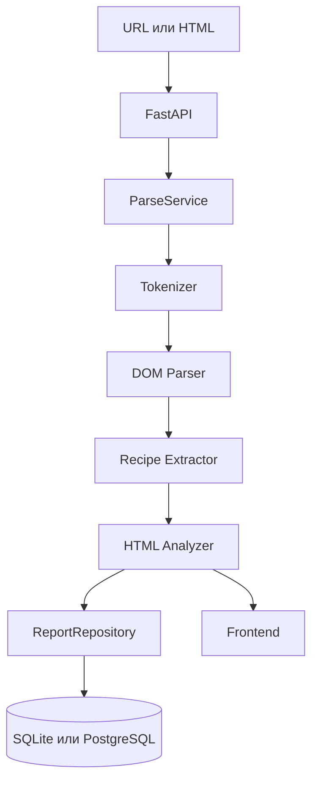

# Архитектура

## Общая схема

```text
Frontend -> FastAPI API -> Services -> parser_engine -> Repository -> Database
```

## Backend

Backend написан на FastAPI. Он содержит:

- routes для анализа HTML и работы с отчетами;
- services для сценариев приложения;
- repository для работы с таблицей `reports`;
- настройки базы данных и CORS;
- parser engine.

Основные endpoints:

- `POST /api/parse/url`
- `POST /api/parse/html`
- `GET /api/reports`
- `GET /api/reports/{id}`
- `DELETE /api/reports/{id}`
- `GET /api/health`

## Frontend

Frontend написан на Next.js и TypeScript.

Страницы:

- `/` — форма анализа URL или HTML;
- `/reports` — история отчетов;
- `/reports/[id]` — подробный отчет.

Frontend берет адрес backend из переменной `NEXT_PUBLIC_API_URL`.

## Parser Engine

`backend/app/parser_engine/` содержит учебную реализацию parser engine:

- `tokenizer.py` — разбивает HTML на токены;
- `dom_parser.py` — строит DOM-дерево;
- `recipe_extractor.py` — извлекает данные рецепта;
- `html_analyzer.py` — ищет ошибки и считает метрики;
- `models.py` — общие модели данных.

## База данных

Для локального запуска используется SQLite. Это упрощает проверку проекта: отдельную базу поднимать не нужно.

При запуске через Docker используется PostgreSQL. Backend подключается к нему через `DATABASE_URL`, а таблицы создаются автоматически при старте приложения.

## Диаграмма


